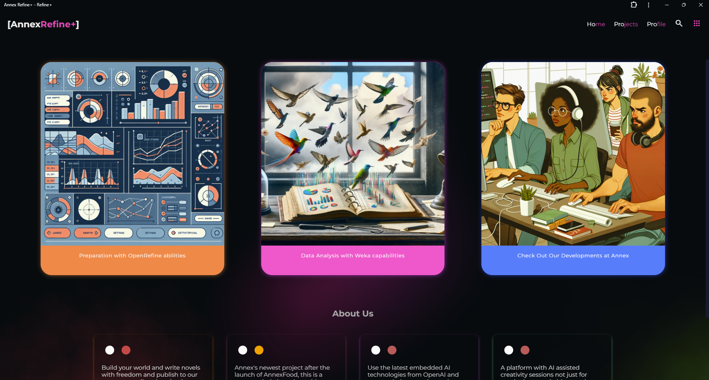
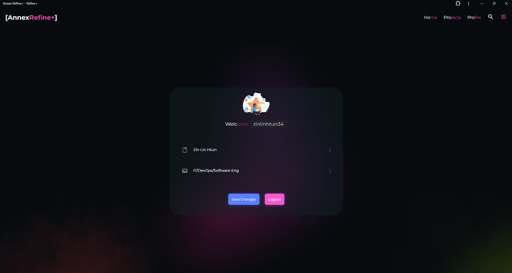
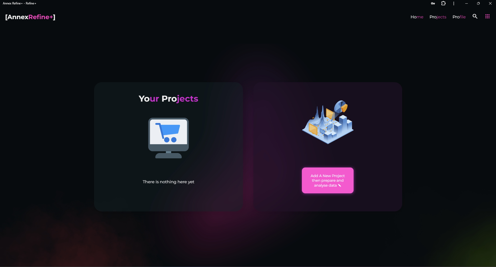
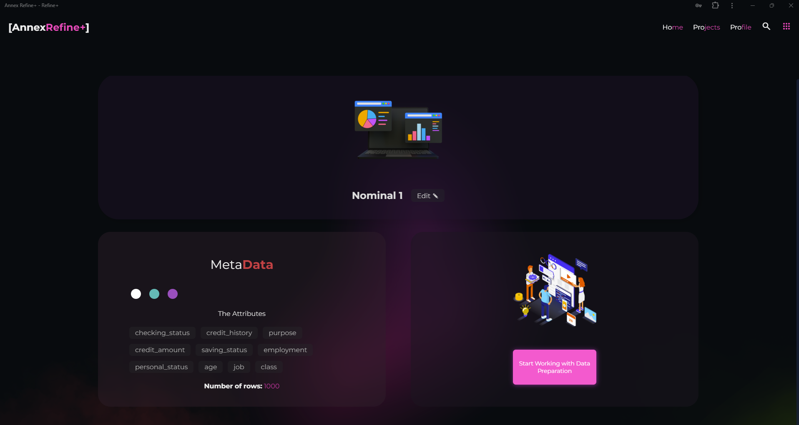

# Refine Plus

- The new Open Refine with `Flask` and `React TSX`
- This is where the fun begins
- Here the features include
- Modern UI
  - 
  - 
  - 
- Built with `React`
- Authentication to Lock your Project from other users on the same `VM/PC`
  - 
  - 
- Analysis on `CSV` meta data
  - 